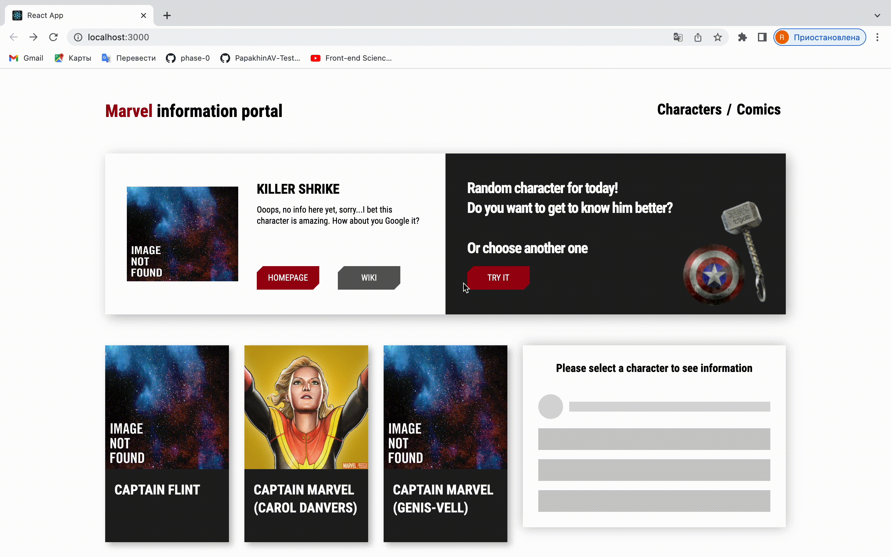
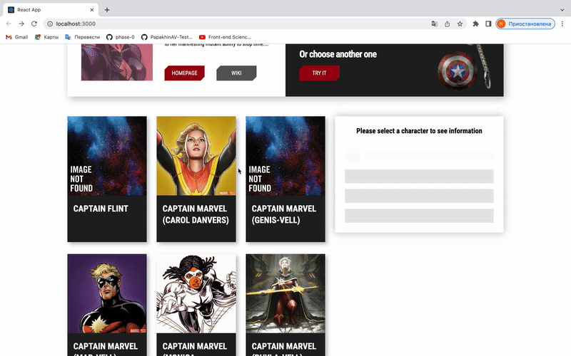
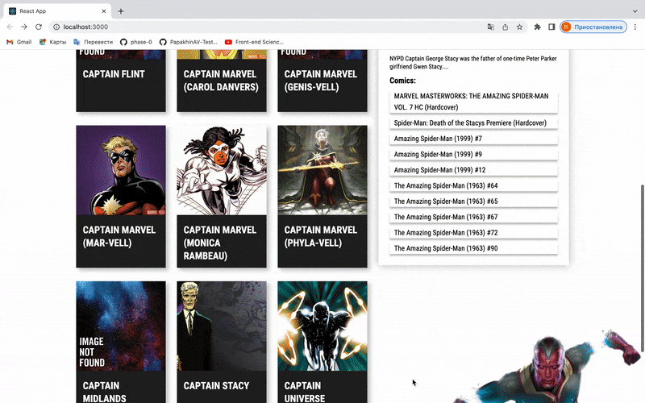
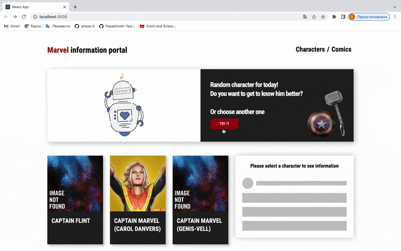

# React приложение с использованием API 
## Стэк - React, JS, HTML, CSS
### Разработчик:
- [Ригина П.]

Приложение создано в рамках работы над заданиями курса Ивана Петриченко ["Полный курс по JavaScript + React - с нуля до результата"]

### Приложение позволяет пользователю:
- Получить информацию о рандомно выбранном персонаже комиксов 
- Просмотреть список персонажей комиксов и выбрать одного из них для того, чтобы увидеть, в каких комиксах данный персонаж упоминается
- Прокрутить список персонажей вниз и загрузить еще персонажей
- В случае отсутствия информации получить сообщение об ошибке
#
### `Получение информации о рандомно выбранном персонаже комиксов`

#
### `Просмотр списка персонажей комиксов и выбор одного из них`

#
### `Прокрутка списка персонажей вниз и загрузка дополнительных персонажей`
 

#
### `Получение сообщения об ошибке`
 

[Ригина П.]: https://github.com/riginapapakhina
["Полный курс по JavaScript + React - с нуля до результата"]: https://www.udemy.com/course/javascript_full/
